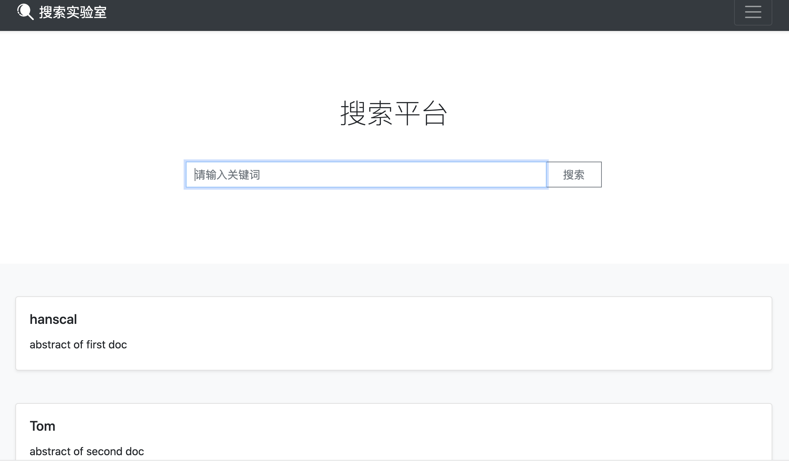

## 前言

使用jQuery实现搜索的前端页面展示  

### jQuery —— 简化的 JavaScript

jQuery 曾经是最流行的 Web 前端 JavaScript 库，可是现在无论是国内还是国外他的使用率正在渐渐被其他的基于 [MVVM](https://www.cnblogs.com/iovec/p/7840228.html) 思想的  JavaScript 库（例如  Vue，React，Angular）所代替，随着浏览器厂商对 HTML5 规范统一遵循以及 ECMA6 在浏览器端的实现，jQuery 的使用率将会越来越低。

jQuery 是使用选择器 `$` 选取 DOM（文档对象模型，可以理解成 HTML 中的元素）对象，对其进行赋值、取值、事件绑定等操作，其实和原生的 JavaScript 的区别只在于可以更方便的选取和操作 DOM 对象，而数据和界面是在一起的。比如需要获取 label 标签的内容：`$("lable").val();` ，它还是依赖 DOM 元素的值。 

<!--more-->

### Bootstrap 4 —— 组件样式库

Bootstrap 是一个用于使用 HTML，CSS 和 JS 进行开发的开源工具包。曾经也是世界上最受欢迎的前端组件库，在网络上构建响应迅速，移动优先的项目。这次使用的是最新版的 Bootstrap 4 开发，使用 Bootstrap 4 可以非常便捷快速地构建美观的页面。Bootstrap 基于 jQuery，也就是说必须引入 jQuery 才可以使用 Bootstrap。需要注意的是 Bootstrap 的中文网已经停止更新了，最新的内容请到 [Bootstrap 英文官网](https://getbootstrap.com/) 查看。

### Iconfont —— 阿里巴巴矢量图片库

[Iconfont](http://www.iconfont.cn) 中可以找到很多简约好用的矢量图，这次我们使用了其中的搜索图标。

## 项目结构

```
search-web
├── README.md
├── src
│   ├── __init__.py
│   └── tools.py
├── static
│   ├── css
│   │   └── index.css
│   ├── img
│   │   ├── favicon.ico
│   │   └── search-white.png
│   ├── js
│   │   └── index.js
│   └── lib
│       ├── bootstrap-4.1.3-dist
│       └── jquery-3.3.1.min.js
├── templates
│   └── index.html
└── start_web.py

```

* `css` 文件夹下存放的是CSS文件。
* `js` 文件夹下存放的是JavaScript文件。
* `img` 文件夹下存放的是项目用到的图片。
* `lib` 文件夹中是需要调用的库文件，比如jQuery和Bootstrap。
* `favicon.ico` 文件是浏览器标签页中显示的小图片。
* `index.html` 主页面。

## 编写页面

首先我们来看一下我们的目标页面结果是怎么样的：


在加上搜索结果以后的效果：



页面由三个部分组成：

1. 顶部导航栏
2. 标题
3. 搜索框
4. 搜索结果

主要参考这个[项目](https://github.com/RyanLiGod/solr-web.git) ,感谢作者！
